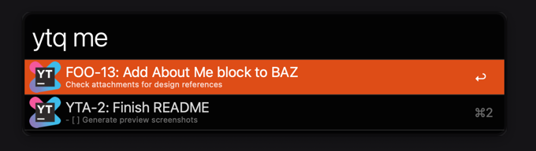

# Integrate [Alfred](https://www.alfredapp.com/) into your [YouTrack](https://www.jetbrains.com/youtrack/) workflow
> Allows for quick issue search in your pubic or private boards.



## Install
```
$ npm i -g alfred-youtrack
```
or
```
$ git clone https://github.com/harvestnide/alfred-youtrack.git && cd alfred-youtrack && npm install
```
> Requires [Node.js](https://nodejs.org) 4+ and the Alfred [Powerpack](https://www.alfredapp.com/powerpack/).

Thanks to [sindresorhus/alfy](https://github.com/sindresorhus/alfy) - that's it. Just don't forget to add configs!

## Commands
- `yts <search-query>` would perform substring search, Using issue id, issue title and issue description as inputs.
- `ytq <search-query>` would perform search using [YouTrack query language](https://www.jetbrains.com/help/youtrack/standalone/Search-and-Command-Attributes.html).

`ytq` is far more flexible that `yts` (because YouTrack queries are awesome :wink:), 
but comes with a downside of requiring additional request for basically each new input character.

## Configuration reference
Workflow requires two inputs to function properly. Refer to official docs linked below. 

| Parameter | Link | Notes | 
| --------- | ------------- | --------- |
| `baseUrl` | [API URL and Endpoints](https://www.jetbrains.com/help/youtrack/devportal/api-url-and-endpoints.html) | `https://` scheme prefix is required |
| `apiToken` | [API Token](https://www.jetbrains.com/help/youtrack/standalone/Manage-Permanent-Token.html#new-permanent-token) |

## Extending functionality
Project has both JS `dist` and TS `src` included, as well as tsc config. Feel free to open issues and PRs, btw

## License
MIT © [Veniamin Sazonov](https://github.com/harvestnide)